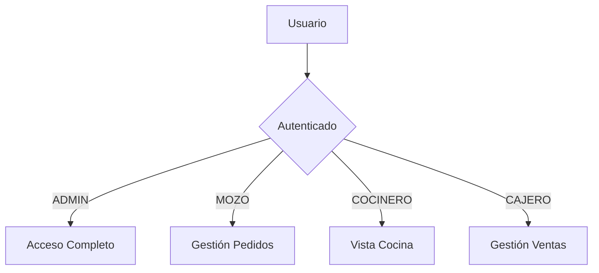

<div align="center">

# 🍽️ Sabor Gourmet
## Sistema de Gestión de Restaurante


**Sistema empresarial completo para la gestión integral de restaurantes**

[Características](#-características) • [Instalación](#-instalación-rápida) • [Módulos](#-módulos-del-sistema) • [Tecnologías](#-stack-tecnológico)

</div>

---

## 🚀 Características

| Característica | Descripción |
|---------------|-------------|
| 🔐 **Seguridad Avanzada** | Autenticación con BCrypt y autorización por roles |
| 📊 **Auditoría Automática** | Registro de todas las operaciones mediante AOP |
| 🎨 **Interfaz Moderna** | Diseño responsive con Bootstrap 5 |
| 📱 **Multi-dispositivo** | Compatible con tablets y móviles |
| ⚡ **Alto Rendimiento** | Arquitectura MVC optimizada con Spring Boot |

---

## ⚙️ Instalación Rápida

### Prerrequisitos

```bash
✓ Java 17 o superior
✓ Maven 3.6+
✓ MySQL 8.0+
✓ IDE (IntelliJ IDEA recomendado)
```

### Paso 1: Clonar el Proyecto

```bash
git clone [url-del-repositorio]
cd exam3
```

### Paso 2: Configurar Base de Datos

```sql
CREATE DATABASE sabor_gourmet CHARACTER SET utf8mb4 COLLATE utf8mb4_unicode_ci;
```

### Paso 3: Configurar Credenciales

Editar `src/main/resources/application.properties`:

```properties
spring.datasource.url=jdbc:mysql://localhost:3306/sabor_gourmet
spring.datasource.username=root
spring.datasource.password=tu_password
```

### Paso 4: Ejecutar

```bash
mvn spring-boot:run
```

### Paso 5: Acceder

🌐 **URL**: http://localhost:8080

---

## 👥 Usuarios por Defecto

| 👤 Usuario | 🔑 Contraseña | 🎭 Rol | 📋 Permisos |
|-----------|---------------|--------|-------------|
| `admin` | `admin123` | **ADMIN** | Acceso completo |
| `mozo` | `mozo123` | **MOZO** | Gestión de pedidos |
| `cocinero` | `cocinero123` | **COCINERO** | Vista de cocina |
| `cajero` | `cajero123` | **CAJERO** | Gestión de ventas |

---

## 📦 Módulos del Sistema

### 🧑‍🤝‍🧑 Clientes y Mesas
- ✅ Registro y consulta de clientes
- ✅ Gestión de estados de mesas
- ✅ Asignación automática

### 🍕 Menú y Platos
- ✅ Catálogo de platos y bebidas
- ✅ Control de precios
- ✅ Asociación con insumos

### 📋 Pedidos
- ✅ Registro de pedidos
- ✅ Estados: Pendiente → En Preparación → Servido → Cerrado
- ✅ Vista especial para cocina

### 💰 Ventas y Facturación
- ✅ Generación automática de facturas
- ✅ Múltiples métodos de pago
- ✅ Control de pagos

### 📦 Inventario
- ✅ Gestión de insumos
- ✅ Control de stock
- ✅ Alertas de stock bajo

### 🔒 Administración
- ✅ Gestión de usuarios y roles
- ✅ Bitácora de auditoría automática

---

## 🏗️ Arquitectura

```
sabor-gourmet/
│
├── 📁 src/main/java/pe/edu/uni/saborgourmet/
│   ├── 🎯 aspect/          → Aspectos AOP (Auditoría)
│   ├── ⚙️  config/          → Configuraciones (Security)
│   ├── 🎮 controller/      → Controladores MVC
│   ├── 📊 entity/          → Entidades JPA
│   ├── 💾 repository/       → Repositorios Spring Data
│   └── 🔧 service/          → Lógica de negocio
│
└── 📁 src/main/resources/
    ├── 🎨 templates/       → Vistas Thymeleaf
    ├── 🎨 static/css/       → Estilos CSS
    └── ⚙️  application.properties
```

---

## 🛠️ Stack Tecnológico

<div align="center">

| Categoría | Tecnología | Versión |
|-----------|-----------|---------|
| **Framework** | Spring Boot | 3.2.0 |
| **Seguridad** | Spring Security | 6.x |
| **Persistencia** | Spring Data JPA | - |
| **Aspectos** | Spring AOP | - |
| **Base de Datos** | MySQL | 8.0+ |
| **Templates** | Thymeleaf | - |
| **Frontend** | Bootstrap | 5.3.0 |
| **Cifrado** | BCrypt | - |

</div>

---

## 🔐 Sistema de Roles



### Matriz de Permisos

| Ruta | ADMIN | MOZO | COCINERO | CAJERO |
|------|:-----:|:----:|:--------:|:------:|
| `/admin/**` | ✅ | ❌ | ❌ | ❌ |
| `/pedidos/**` | ✅ | ✅ | ✅ | ❌ |
| `/ventas/**` | ✅ | ❌ | ❌ | ✅ |
| `/inventario/**` | ✅ | ❌ | ❌ | ❌ |

---

## 📝 Auditoría con AOP

El sistema registra **automáticamente** todas las operaciones:

```java
✅ CREAR    → Nuevo registro creado
✅ ACTUALIZAR → Registro modificado
✅ ELIMINAR → Registro eliminado
```

**Información registrada:**
- 👤 Usuario que realizó la acción
- 📊 Tabla afectada
- 🆔 ID del registro
- 📅 Fecha y hora
- 🔄 Tipo de operación

---

## 🚀 Comandos Útiles

```bash
# Compilar proyecto
mvn clean install

# Ejecutar tests
mvn test

# Empaquetar para producción
mvn clean package

# Ejecutar JAR
java -jar target/sabor-gourmet-1.0.0.jar
```

---


## ⚠️ Notas Importantes

- 🔒 Las contraseñas se almacenan cifradas con BCrypt
- 📝 Todas las acciones CRUD se registran en la bitácora
- 🔐 Autenticación requerida para todas las rutas (excepto `/login`)
- 👥 Los roles determinan el acceso a funcionalidades


## 👨‍💻 Desarrollo

**Proyecto académico** desarrollado para el curso de Desarrollo de Aplicaciones Web

### Características Técnicas Implementadas

- ✅ Arquitectura MVC
- ✅ Programación Orientada a Aspectos (AOP)
- ✅ Seguridad con Spring Security
- ✅ Persistencia con JPA/Hibernate
- ✅ Validación de formularios
- ✅ Manejo de excepciones


</div>

